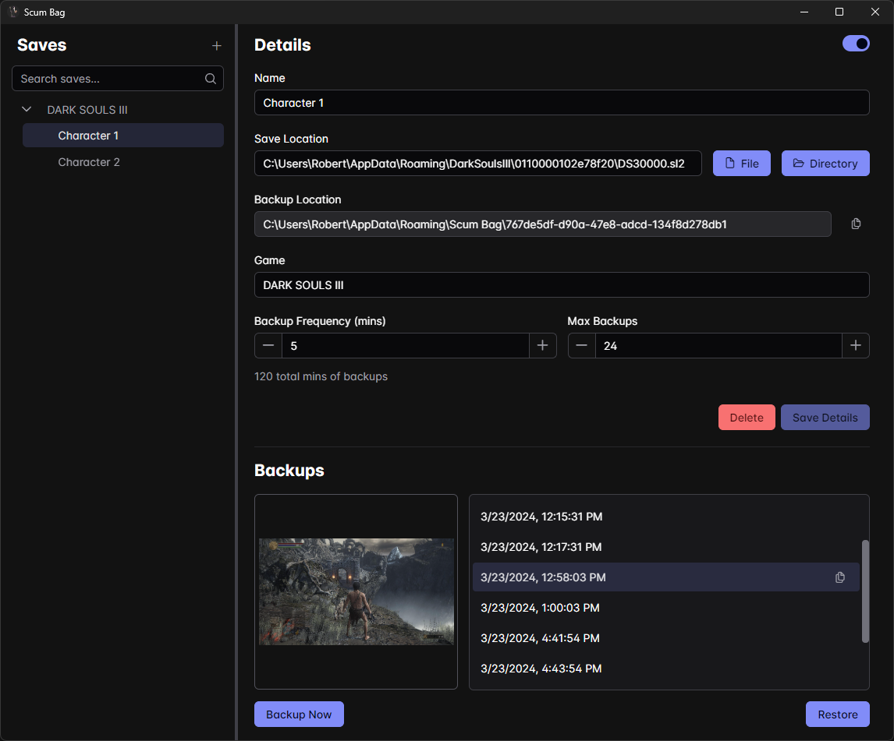

# Scum Bag - Save Scummer

## About
Scum Bag is a place to hold all of your save backups. It automatically backs up your save files at a given interval and lets you restore to any point. Powered by [Galdr](https://github.com/rthomasv3/Galdr).

### Features

* Create a new save profile with frequency and max backups
* Restore to any backup point
* Only makes a backup if the file(s) actually changed
* Reads steam libraries to find installed games
* Takes a screenshot of the game window when the save file changes
    * Requires `flameshot` on Linux and screenshots are only full screen
    * Supports both windowed and fullscreen apps on Windows

## Requirements

* Windows 11
    * Should work natively
* Windows 10
    * Requires [Webview2 runtime](https://developer.microsoft.com/en-us/microsoft-edge/webview2/)
* Linux and BSD
    * Requires `flameshot` for screenshots
    * Requires [WebKit2GTK](https://webkitgtk.org/)
    * Debian-based
        * `apt install libgtk-3-0 libwebkit2gtk-4.1-dev`
    * Fedora-based
        * `dnf install gtk3 webkit2gtk4.1-devel`
    * BSD-based
        * `pkg install webkit2-gtk3`
        * Execution on BSD-based systems may require adding the `wxallowed` option to your fstab to bypass [W^X](https://en.wikipedia.org/wiki/W%5EX) memory protection for your executable (see [mount(8)](https://man.openbsd.org/mount.8))
* macOS
    * Requires [WebKit](https://webkit.org/downloads/)
